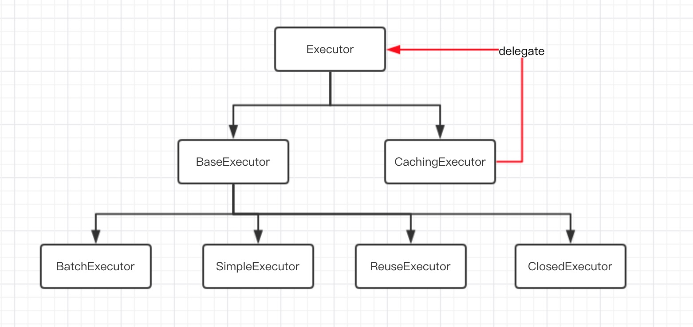

Executor是Mybatis里面重要的一个接口，是4大对象（Executor、StatementHandler、ParameterHandler、ResultSetHandler）中的一个，下面我们先来看看Executor的继承关系图：



Mybatis默认启用了 `CachingExecutor`，它是用来做二级缓存的，但是如果没有配置 `<cache />` 的话默认不启用二级缓存。它根据 `ExecutorType` 来进行选择不同的 `Executor`，并在它内部维护了一个 `delegate` 的Executor对象，用它来执行真正的请求，说白了就是个装饰者模式。

```java
// 只列出了重要的部分，可以看它就是通过delegate来执行真正的方法的
public class CachingExecutor implements Executor {
    private Executor delegate;
    private TransactionalCacheManager tcm = new TransactionalCacheManager();

    public CachingExecutor(Executor delegate) {
        this.delegate = delegate;
        delegate.setExecutorWrapper(this);
    }

    @Override
    public int update(MappedStatement ms, Object parameterObject) throws SQLException {
        flushCacheIfRequired(ms);
        return delegate.update(ms, parameterObject);
    }

    @Override
    public <E> List<E> query(MappedStatement ms, Object parameterObject, RowBounds rowBounds, ResultHandler resultHandler, CacheKey key, BoundSql boundSql)
            throws SQLException {
        return delegate.<E> query(ms, parameterObject, rowBounds, resultHandler, key, boundSql);
    }

    @Override
    public List<BatchResult> flushStatements() throws SQLException {
        return delegate.flushStatements();
    }

    @Override
    public void commit(boolean required) throws SQLException {
        delegate.commit(required);
        tcm.commit();
    }

    @Override
    public void rollback(boolean required) throws SQLException {
        delegate.rollback(required);
    }
}
```

那什么时候初始化Executor的呢？我们从SqlSessionFactory来看起。
```java
private SqlSession openSessionFromDataSource(ExecutorType execType, TransactionIsolationLevel level, boolean autoCommit) {
    Transaction tx = null;
    try {
        final Environment environment = configuration.getEnvironment();
        final TransactionFactory transactionFactory = getTransactionFactoryFromEnvironment(environment);
        tx = transactionFactory.newTransaction(environment.getDataSource(), level, autoCommit);
        // 创建executor
        final Executor executor = configuration.newExecutor(tx, execType);
        return new DefaultSqlSession(configuration, executor, autoCommit);
    } catch (Exception e) {
        closeTransaction(tx); // may have fetched a connection so lets call close()
        throw ExceptionFactory.wrapException("Error opening session.  Cause: " + e, e);
    } finally {
        ErrorContext.instance().reset();
    }
}

public Executor newExecutor(Transaction transaction, ExecutorType executorType) {
    executorType = executorType == null ? defaultExecutorType : executorType;
    executorType = executorType == null ? ExecutorType.SIMPLE : executorType;
    Executor executor;
    // 根据不同的ExecutorType初始化不同的Executor
    if (ExecutorType.BATCH == executorType) {
        executor = new BatchExecutor(this, transaction);
    } else if (ExecutorType.REUSE == executorType) {
        executor = new ReuseExecutor(this, transaction);
    } else {
        executor = new SimpleExecutor(this, transaction);
    }
    // 默认cacheEnabled=true，把executor放入CachingExecutor中
    if (cacheEnabled) {
        executor = new CachingExecutor(executor);
    }
    executor = (Executor) interceptorChain.pluginAll(executor);
    return executor;
}
```

每个sqlSession对应不同的Executor，在spring中，同一个事务里的sqlSession是相同的。

`SimpleExecutor、BatchExecutor、ReuseExecutor、ClosedExecutor`都重写了 `BaseExecutor` 的几个方法

```java
protected abstract int doUpdate(MappedStatement ms, Object parameter)
        throws SQLException;
protected abstract List<BatchResult> doFlushStatements(boolean isRollback)
        throws SQLException;
protected abstract <E> List<E> doQuery(MappedStatement ms, Object parameter, RowBounds rowBounds, ResultHandler resultHandler, BoundSql boundSql)
        throws SQLException;
protected abstract <E> Cursor<E> doQueryCursor(MappedStatement ms, Object parameter, RowBounds rowBounds, BoundSql boundSql)
        throws SQLException;
```
下面我们来分析不同的Executor的实现细节

# 1、SimpleExecutor

```java
public class SimpleExecutor extends BaseExecutor {

	public SimpleExecutor(Configuration configuration, Transaction transaction) {
		super(configuration, transaction);
	}

	@Override
	public int doUpdate(MappedStatement ms, Object parameter) throws SQLException {
		Statement stmt = null;
		try {
			Configuration configuration = ms.getConfiguration();
			// 新建RoutingStatementHandler
			StatementHandler handler = configuration.newStatementHandler(this, ms, parameter, RowBounds.DEFAULT, null, null);
			stmt = prepareStatement(handler, ms.getStatementLog());
			return handler.update(stmt);
		} finally {
			// 关闭statement
			closeStatement(stmt);
		}
	}

	@Override
	public <E> List<E> doQuery(MappedStatement ms, Object parameter, RowBounds rowBounds, ResultHandler resultHandler, BoundSql boundSql) throws SQLException {
		Statement stmt = null;
		try {
			Configuration configuration = ms.getConfiguration();
			StatementHandler handler = configuration.newStatementHandler(wrapper, ms, parameter, rowBounds, resultHandler, boundSql);
			stmt = prepareStatement(handler, ms.getStatementLog());
			return handler.<E>query(stmt, resultHandler);
		} finally {
			closeStatement(stmt);
		}
	}

	@Override
	protected <E> Cursor<E> doQueryCursor(MappedStatement ms, Object parameter, RowBounds rowBounds, BoundSql boundSql) throws SQLException {
		Configuration configuration = ms.getConfiguration();
		StatementHandler handler = configuration.newStatementHandler(wrapper, ms, parameter, rowBounds, null, boundSql);
		Statement stmt = prepareStatement(handler, ms.getStatementLog());
		return handler.<E>queryCursor(stmt);
	}

	@Override
	public List<BatchResult> doFlushStatements(boolean isRollback) throws SQLException {
		return Collections.emptyList();
	}

	private Statement prepareStatement(StatementHandler handler, Log statementLog) throws SQLException {
		Statement stmt;
		// 从事务中获取连接
		Connection connection = getConnection(statementLog);
		stmt = handler.prepare(connection, transaction.getTimeout());
		handler.parameterize(stmt);
		return stmt;
	}

}
```

源码其实很简单，每个方法几乎都分为以下几步：

1. 获取配置
2. 新创建一个statementHandler
3. 准备statement
4. 执行真正的查询、更新方法


# 2、ReuseExecutor

ReuseExecutor的实现其实和SimpleExecutor的类似，只不过内部维护了一个map来缓存statement

```java
public class ReuseExecutor extends BaseExecutor {

	/**
	 * 缓存了statement
	 * key：sql value：statement
	 */
	private final Map<String, Statement> statementMap = new HashMap<String, Statement>();

	public ReuseExecutor(Configuration configuration, Transaction transaction) {
		super(configuration, transaction);
	}

	@Override
	public int doUpdate(MappedStatement ms, Object parameter) throws SQLException {
		Configuration configuration = ms.getConfiguration();
		StatementHandler handler = configuration.newStatementHandler(this, ms, parameter, RowBounds.DEFAULT, null, null);
		Statement stmt = prepareStatement(handler, ms.getStatementLog());
		return handler.update(stmt);
	}

	@Override
	public <E> List<E> doQuery(MappedStatement ms, Object parameter, RowBounds rowBounds, ResultHandler resultHandler, BoundSql boundSql) throws SQLException {
		Configuration configuration = ms.getConfiguration();
		StatementHandler handler = configuration.newStatementHandler(wrapper, ms, parameter, rowBounds, resultHandler, boundSql);
		Statement stmt = prepareStatement(handler, ms.getStatementLog());
		return handler.<E>query(stmt, resultHandler);
	}

	@Override
	protected <E> Cursor<E> doQueryCursor(MappedStatement ms, Object parameter, RowBounds rowBounds, BoundSql boundSql) throws SQLException {
		Configuration configuration = ms.getConfiguration();
		StatementHandler handler = configuration.newStatementHandler(wrapper, ms, parameter, rowBounds, null, boundSql);
		Statement stmt = prepareStatement(handler, ms.getStatementLog());
		return handler.<E>queryCursor(stmt);
	}

	@Override
	public List<BatchResult> doFlushStatements(boolean isRollback) throws SQLException {
		for (Statement stmt : statementMap.values()) {
			closeStatement(stmt);
		}
		statementMap.clear();
		return Collections.emptyList();
	}

	private Statement prepareStatement(StatementHandler handler, Log statementLog) throws SQLException {
		Statement stmt;
		BoundSql boundSql = handler.getBoundSql();
		String sql = boundSql.getSql();
         // 检查是否有缓存
		if (hasStatementFor(sql)) {
			stmt = getStatement(sql);
			applyTransactionTimeout(stmt);
		} else {
			Connection connection = getConnection(statementLog);
			stmt = handler.prepare(connection, transaction.getTimeout());
			putStatement(sql, stmt);
		}
		handler.parameterize(stmt);
		return stmt;
	}

	private boolean hasStatementFor(String sql) {
		try {
			return statementMap.keySet().contains(sql) && !statementMap.get(sql).getConnection().isClosed();
		} catch (SQLException e) {
			return false;
		}
	}

	private Statement getStatement(String s) {
		return statementMap.get(s);
	}

	private void putStatement(String sql, Statement stmt) {
		statementMap.put(sql, stmt);
	}
}
```

因为不同的sqlSession肯定有不同的executor，所以不同的executor即使有map缓存也没有作用。所以只有在同一个sqlSession的时候ReuseExecutor才有作用（在spring事务中可以使用，因为事务中是用的同一个sqlSession）。其他时候使用和SimpleExecutor无差别。


# 3、BatchExecutor

这个类从名字也知道它是用来进行批处理的，主要使用了jdbc的 `statement.addBatch(String sql)` 以及 `statement.executeBatch();` 来执行批处理。

`BatchExecutor` 主要是把不同的Statement以及参数值缓存起来，在调用了 `sqlSession.commit()` 或 带有 `@Flush` 注解的方法时，会调用 `doFlushStatements` 方法把数据批量刷新到表中。

在调用查询方法时，会首先刷新缓存的批量数据，再进行查询。

下面看看它的源码是如何实现的。

```java
public class BatchExecutor extends BaseExecutor {

	public static final int BATCH_UPDATE_RETURN_VALUE = Integer.MIN_VALUE + 1002;

	// 多个statement的集合
	private final List<Statement> statementList = new ArrayList<Statement>();
	// 多个statement处理的结果集合
	private final List<BatchResult> batchResultList = new ArrayList<BatchResult>();
	private String currentSql;
	private MappedStatement currentStatement;

	public BatchExecutor(Configuration configuration, Transaction transaction) {
		super(configuration, transaction);
	}

	@Override
	public int doUpdate(MappedStatement ms, Object parameterObject) throws SQLException {
		final Configuration configuration = ms.getConfiguration();
		final StatementHandler handler = configuration.newStatementHandler(this, ms, parameterObject, RowBounds.DEFAULT, null, null);
		final BoundSql boundSql = handler.getBoundSql();
		final String sql = boundSql.getSql();
		final Statement stmt;
		if (sql.equals(currentSql) && ms.equals(currentStatement)) {
			int last = statementList.size() - 1;
			stmt = statementList.get(last);
			applyTransactionTimeout(stmt);
			handler.parameterize(stmt);//fix Issues 322
			BatchResult batchResult = batchResultList.get(last);
			batchResult.addParameterObject(parameterObject);
		} else {
			Connection connection = getConnection(ms.getStatementLog());
			stmt = handler.prepare(connection, transaction.getTimeout());
			handler.parameterize(stmt);    //fix Issues 322
			currentSql = sql;
			currentStatement = ms;
			statementList.add(stmt);
			batchResultList.add(new BatchResult(ms, sql, parameterObject));
		}
		// handler.parameterize(stmt);
		handler.batch(stmt);
		return BATCH_UPDATE_RETURN_VALUE;
	}

	@Override
	public <E> List<E> doQuery(MappedStatement ms, Object parameterObject, RowBounds rowBounds, ResultHandler resultHandler, BoundSql boundSql)
			throws SQLException {
		Statement stmt = null;
		try {
			// 刷新缓存中的statement到数据库
			flushStatements();
			Configuration configuration = ms.getConfiguration();
			StatementHandler handler = configuration.newStatementHandler(wrapper, ms, parameterObject, rowBounds, resultHandler, boundSql);
			Connection connection = getConnection(ms.getStatementLog());
			stmt = handler.prepare(connection, transaction.getTimeout());
			handler.parameterize(stmt);
			return handler.<E>query(stmt, resultHandler);
		} finally {
			closeStatement(stmt);
		}
	}

	@Override
	protected <E> Cursor<E> doQueryCursor(MappedStatement ms, Object parameter, RowBounds rowBounds, BoundSql boundSql) throws SQLException {
        // 刷新缓存中的statement到数据库
		flushStatements();
		Configuration configuration = ms.getConfiguration();
		StatementHandler handler = configuration.newStatementHandler(wrapper, ms, parameter, rowBounds, null, boundSql);
		Connection connection = getConnection(ms.getStatementLog());
		Statement stmt = handler.prepare(connection, transaction.getTimeout());
		handler.parameterize(stmt);
		return handler.<E>queryCursor(stmt);
	}

	@Override
	public List<BatchResult> doFlushStatements(boolean isRollback) throws SQLException {
		try {
			List<BatchResult> results = new ArrayList<BatchResult>();
			if (isRollback) {
				return Collections.emptyList();
			}
			for (int i = 0, n = statementList.size(); i < n; i++) {
				Statement stmt = statementList.get(i);
				applyTransactionTimeout(stmt);
				BatchResult batchResult = batchResultList.get(i);
				try {
					batchResult.setUpdateCounts(stmt.executeBatch());
					MappedStatement ms = batchResult.getMappedStatement();
					List<Object> parameterObjects = batchResult.getParameterObjects();
					KeyGenerator keyGenerator = ms.getKeyGenerator();
					if (Jdbc3KeyGenerator.class.equals(keyGenerator.getClass())) {
						Jdbc3KeyGenerator jdbc3KeyGenerator = (Jdbc3KeyGenerator) keyGenerator;
						jdbc3KeyGenerator.processBatch(ms, stmt, parameterObjects);
					} else if (!NoKeyGenerator.class.equals(keyGenerator.getClass())) { //issue #141
						for (Object parameter : parameterObjects) {
							keyGenerator.processAfter(this, ms, stmt, parameter);
						}
					}
					// Close statement to close cursor #1109
					closeStatement(stmt);
				} catch (BatchUpdateException e) {
					StringBuilder message = new StringBuilder();
					message.append(batchResult.getMappedStatement().getId())
							.append(" (batch index #")
							.append(i + 1)
							.append(")")
							.append(" failed.");
					if (i > 0) {
						message.append(" ")
								.append(i)
								.append(" prior sub executor(s) completed successfully, but will be rolled back.");
					}
					throw new BatchExecutorException(message.toString(), e, results, batchResult);
				}
				results.add(batchResult);
			}
			return results;
		} finally {
			for (Statement stmt : statementList) {
				closeStatement(stmt);
			}
			currentSql = null;
			statementList.clear();
			batchResultList.clear();
		}
	}

}
```

平时我没有使用过这种方式，都是直接在mapper文件中用for标签拼接字符串的方式来进行批处理，下面我们来做一个实验，对比一下谁的效率高。

```java
// batch方式花费：10869ms
private void testUserMapperBatch() {
	SqlSession sqlSession = MyBatisConfigHelper.getSqlSession(ExecutorType.BATCH);
	UserMapper mapper = sqlSession.getMapper(UserMapper.class);
	long begin = System.currentTimeMillis();
	for (int i = 0; i < 100; i++) {
		for (int j = 0; j < 1000; j++) {
			User user = new User();
			user.setUserName("new名字" + j);
			user.setSex(SEX.MALE);
			user.setRoleId(1L);
			mapper.insert(user);
		}
		sqlSession.commit();
	}
	long end = System.currentTimeMillis();
	System.out.println("batch方式花费：" + (end - begin) + "ms");
}

// batch方式花费：10388ms
private void testUserMapperBatch2() {
	SqlSession sqlSession = MyBatisConfigHelper.getSqlSession(ExecutorType.BATCH);
	UserMapper mapper = sqlSession.getMapper(UserMapper.class);
	long begin = System.currentTimeMillis();
	for (int i = 0; i < 100; i++) {
		for (int j = 0; j < 1000; j++) {
			User user = new User();
			user.setUserName("new名字" + j);
			user.setSex(SEX.MALE);
			user.setRoleId(1L);
			mapper.insert(user);
		}
		mapper.flush();
	}
	sqlSession.commit();
	long end = System.currentTimeMillis();
	System.out.println("batch方式花费：" + (end - begin) + "ms");
}

// mapper文件for循环方式花费：3110ms
private void testInsertBatch() {
	SqlSession sqlSession = MyBatisConfigHelper.getSqlSession(true);
	UserMapper mapper = sqlSession.getMapper(UserMapper.class);
	long begin = System.currentTimeMillis();
	for (int i = 0; i < 100; i++) {
		List<User> users = new ArrayList<>();
		for (int j = 0; j < 1000; j++) {
			User user = new User();
			user.setUserName("new2名字" + j);
			user.setSex(SEX.FEMALE);
			user.setRoleId(1L);
			users.add(user);
		}
		mapper.insertBatch(users);
	}
	long end = System.currentTimeMillis();
	System.out.println("mapper文件for循环方式花费：" + (end - begin) + "ms");
}
```

下面是mapper接口以及对应的mapper.xml

```java
public interface UserMapper {
  
	int insert(User user);

	int insertBatch(List<User> users);

	@Flush
	void flush();
}

<insert id="insert" useGeneratedKeys="true" keyProperty="id" parameterType="user">
	INSERT INTO
	cf_user (user_name, sex, role_id)
	VALUES
	(#{userName}, #{sex, typeHandler=com.github.base.typeHandler.MySexTypeHandler, javaType=sex, jdbcType=INTEGER}, #{roleId})
</insert>

<insert id="insertBatch" useGeneratedKeys="true" keyProperty="id" parameterType="user">
	INSERT INTO
	cf_user (user_name, sex, role_id)
	VALUES
	<foreach collection="list" item="item" index="index" separator=",">
		(#{item.userName}, #{item.sex, typeHandler=com.github.base.typeHandler.MySexTypeHandler, javaType=sex, jdbcType=INTEGER}, #{item.roleId})
	</foreach>
</insert>
```


前两个用batch的方式，一种1000个数据一提交（防止OOM），另一种1000个数据一flush，插入的时间都花了10秒左右，而用字符串组装的方式却只用了3秒。怪不得没人用BatchExecutor的方式呢。

不过如果你想在spring中使用，只需要进行简单的配置就可以了，这样我们就可以通过 `@Autowired` 或者 `@Resource` 就可以进行同一个interface不同配置来使用了。

```java
<bean id="springMapperScannerConfigurer" class="org.mybatis.spring.mapper.MapperScannerConfigurer">
	<property name="sqlSessionFactoryBeanName" value="sqlSessionFactory" />
	<property name="basePackage" value="com.github.template.dao.mapper"/>
</bean>

<bean id="userDao" class="org.mybatis.spring.mapper.MapperFactoryBean">
	<property name="mapperInterface" value="com.xx.xx.UserMapper" />
	<property name="sqlSessionTemplate" ref="userTemplate" />
</bean>

<bean id="userTemplate" class="org.mybatis.spring.SqlSessionTemplate">
	<constructor-arg index="0" ref="sqlSessionFactory2" />
	<constructor-arg index="1" value="BATCH" />
</bean>

@Autowired
private UserMapper userMapper;	// 注入的是默认扫描的mapper
@Resource
private UserMapper userMapper;	// 注入的是默认扫描的mapper

@Autowired
@Qualifier("userDao")
private UserMapper userMapper;	// 注入的是userDao
@Resource(name = "userDao")
private UserMapper userMapper;	// 注入的是userDao

@Autowired
private UserMapper userDao;	// 注入的是userDao
@Resource
private UserMapper userDao;	// 注入的是userDao
```

# 4、ClosedExecutor

这个类是 `ResultLoaderMap` 的内部类，外部没法使用，可以不用了解。