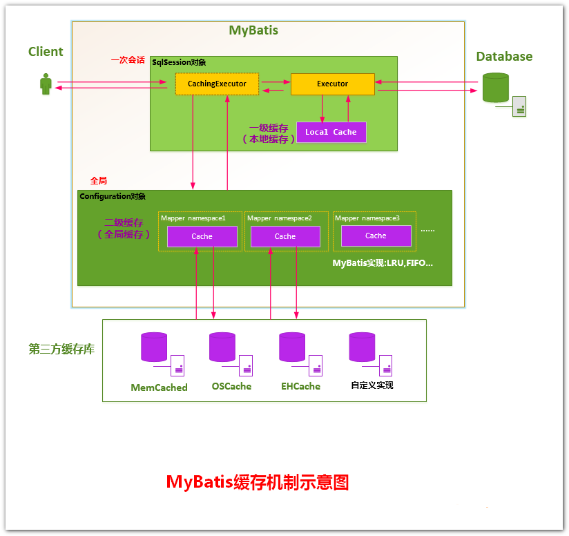

# 1.mybatis中的缓存原理（不结合spring）

Mybatis中有一级缓存和二级缓存，默认情况下一级缓存是开启的，而且是不能关闭的。一级缓存是指SqlSession级别的缓存，当在同一个SqlSession中进行相同的SQL语句查询时，第二次以后的查询不会从数据库查询，而是直接从缓存中获取，一级缓存最多缓存1024条SQL。二级缓存是指可以跨SqlSession的缓存。 我们可以通过一张图来了解什么是一级缓存和二级缓存。


## 1.1.一级缓存
一级缓存是默认启用的，在BaseExecutor的query()方法中实现，底层默认使用的是PerpetualCache实现，PerpetualCache采用HashMap存储数据。一级缓存会在进行增、删、改操作时进行清除。  

```java
// 维护者一个map的缓存
protected PerpetualCache localCache;
protected PerpetualCache localOutputParameterCache; 
  
public <E> List<E> query(MappedStatement ms, Object parameter, RowBounds rowBounds, ResultHandler resultHandler, CacheKey key, BoundSql boundSql) throws SQLException {
     // ...
  
	// 上一个查询执行完成 并且 <select>标签增加了flushCache="true" 刷新一级缓存
	if (queryStack == 0 && ms.isFlushCacheRequired()) {
		clearLocalCache();
	}
	List<E> list;
	try {
		queryStack++;
		// 对于指定了resultHandler的查询，不走缓存。否则从缓存中查询。
		list = resultHandler == null ? (List<E>) localCache.getObject(key) : null;
		if (list != null) {
			// 如果存在缓存参数值，取出来覆盖当前参数值，只针对Callable
			handleLocallyCachedOutputParameters(ms, key, parameter, boundSql);
		} else {
			// 缓存中没有，从数据库中查询放入缓存
			list = queryFromDatabase(ms, parameter, rowBounds, resultHandler, key, boundSql);
		}
	} finally {
		queryStack--;
	}
	if (queryStack == 0) {
		for (DeferredLoad deferredLoad : deferredLoads) {
			deferredLoad.load();
		}
		// issue #601
		deferredLoads.clear();
		if (configuration.getLocalCacheScope() == LocalCacheScope.STATEMENT) {
			// cacheScope配置了statement，查询完后清除缓存
			clearLocalCache();
		}
	}
	return list;
}
  
@Override
public void clearLocalCache() {
	if (!closed) {
		localCache.clear();
		localOutputParameterCache.clear();
	}
}

private <E> List<E> queryFromDatabase(MappedStatement ms, Object parameter, RowBounds rowBounds, ResultHandler resultHandler, CacheKey key, BoundSql boundSql) throws SQLException {
	List<E> list;
	// 放入一个初始值
	localCache.putObject(key, EXECUTION_PLACEHOLDER);
	try {
		list = doQuery(ms, parameter, rowBounds, resultHandler, boundSql);
	} finally {
		localCache.removeObject(key);
	}
	// 放入一级缓存
	localCache.putObject(key, list);
	if (ms.getStatementType() == StatementType.CALLABLE) {
		localOutputParameterCache.putObject(key, parameter);
	}
	return list;
}
```

可以看到上面的查询方法先是看<select>有没有flushCache="true"，有就刷新一级缓存，没有的话先去从一级缓存取数据，如果一级缓存里没有结果，调用`queryFromDatabase`方法，从数据库查询结果并返回。

一级缓存的范围有 `SESSION` 和 `STATEMENT` 两种，默认是 `SESSION` ，如果我们不需要使用一级缓存，那么我们可以把一级缓存的范围指定为STATEMENT，这样每次执行完一个Mapper语句后都会将一级缓存清除。如果需要更改一级缓存的范围，请在Mybatis的配置文件中，在<settings>下通过localCacheScope指定。  

我们发现同一个SqlSession的情况下会清除一级缓存，但是不同的SqlSession之间会出现脏数据问题，必须自己手动指定flush。

> 结论：一级缓存默认存在，不想使用有两种方法关闭。
> 1. <select>指定flushCache="true"
> 2. <setting name="localCacheScope" value="SESSION"/>

## 1.2.二级缓存

mybatis默认Configuration中是启用二级缓存的，可以通过改变配置 `cacheEnabled="false"` 来不走二级缓存。  

默认二级缓存使用CachingExecutor来分发执行sql，但是要想真正启用二级缓存，还得在xml中指定<cache />，这样才会真正生效，每个sql标签默认有个属性useCache，默认是true，如果单独某个或某几个sql不想使用二级缓存，可以指定useCache="false"。

<cache />的具体使用如下：

```java
<!--
		eviction：代表的是缓存回收策略
			LRU：最近最少使用的，移除最长时间不用的对象
			FIFO：先进先出，按对象进入缓存的顺序来移除他们
			SOFT：软引用，移除基于垃圾回收器状态和软引用规则的对象
			WEAK：弱引用，更积极地移除基于垃圾回收器状态和弱引用规则的对象。
		flushInterval：刷新间隔时间，单位为毫秒，这里配置的是100秒刷新，如果你不配置它，那么当SQL被执行的时候才会去刷新缓存
		size：引用数目，代表缓存最多可以存储多少个对象，不宜设置过大，过大会导致内存溢出。
		readOnly：只读，意味着缓存数据只能读取而不能修改，这样设置的好处是我们可以快速读取缓存，缺点是我们没办法修改缓存。
		type可以指定自定义的缓存，例如用redis来存储。
		-->
<cache eviction="LRU" flushInterval="100000" size="1024" readOnly="true" />
<cache type="com.github.core.cache.MyCache"/>
```

接下来我们来看看二级缓存的实现：

```java
@Override
public <E> List<E> query(MappedStatement ms, Object parameterObject, RowBounds rowBounds, ResultHandler resultHandler, CacheKey key, BoundSql boundSql)
		throws SQLException {
	// 获取二级缓存
	Cache cache = ms.getCache();
	if (cache != null) {
		// 根据ms来决定是否刷新缓存
		flushCacheIfRequired(ms);
		if (ms.isUseCache() && resultHandler == null) {
			ensureNoOutParams(ms, parameterObject, boundSql);
			@SuppressWarnings("unchecked")
			List<E> list = (List<E>) tcm.getObject(cache, key);
			if (list == null) {
				list = delegate.<E> query(ms, parameterObject, rowBounds, resultHandler, key, boundSql);
				// 放入二级缓存
				tcm.putObject(cache, key, list); // issue #578 and #116
			}
			return list;
		}
	}
	return delegate.<E> query(ms, parameterObject, rowBounds, resultHandler, key, boundSql);
}

private void flushCacheIfRequired(MappedStatement ms) {
	Cache cache = ms.getCache();
	// 如果指定<cache /> 并且sql标签指定 flushCache="true" 清空二级缓存
	if (cache != null && ms.isFlushCacheRequired()) {
		tcm.clear(cache);
	}
}

@Override
public int update(MappedStatement ms, Object parameterObject) throws SQLException {
	flushCacheIfRequired(ms);
	return delegate.update(ms, parameterObject);
}
```

> 结论：
> 1. 二级缓存开启需要指定<cache />
> 2. 不使用二级缓存类CachingExecutor：<setting name="cacheEnabled" value="false"/>
> 3. 查询标签默认属性 flushCache="false" 和 useCache="true"
> 4. 其他标签默认属性 flushCache="true" 和 useCache="false"

# 2.mybatis在spring中的缓存

在之前的文章中，我们说到了spring中sqlSession是如何运作的，不懂的可以复习一遍：[Mybatis在spring中注入接口原理分析下篇](http://benjaminwhx.com/2018/02/04/mybatis%E5%9C%A8spring%E4%B8%AD%E6%B3%A8%E5%85%A5%E6%8E%A5%E5%8F%A3%E5%8E%9F%E7%90%86%E5%88%86%E6%9E%90%E4%B8%8B%E7%AF%87/)

上面我们针对mybatis自身的缓存做了讲解，下面我们直接看 `SqlSessionInterceptor` 来看看spring中执行statement时对缓存是如何处理的。下面分两种情况，一种是在spring中没有开启事务的查询，另外一种是开启事务的查询。

## 2.1、没有开启事务

先来看一波涉及到的相关源码
```java
private class SqlSessionInterceptor implements InvocationHandler {
	@Override
	public Object invoke(Object proxy, Method method, Object[] args) throws Throwable {
      	// 1、每次都new一个sqlSession
		SqlSession sqlSession = getSqlSession(
				SqlSessionTemplate.this.sqlSessionFactory,
				SqlSessionTemplate.this.executorType,
				SqlSessionTemplate.this.exceptionTranslator);
		try {
             // 2、执行查询方法
			Object result = method.invoke(sqlSession, args);
			if (!isSqlSessionTransactional(sqlSession, SqlSessionTemplate.this.sqlSessionFactory)) {
              	 // 3、强制提交，清空缓存
				sqlSession.commit(true);
			}
			return result;
		} catch (Throwable t) {
		} finally {
			if (sqlSession != null) {
              	 // 4、close操作
				closeSqlSession(sqlSession, SqlSessionTemplate.this.sqlSessionFactory);
			}
		}
	}
}

// BaseExecutor类，required=true
public void commit(boolean required) throws SQLException {
	if (closed) {
		throw new ExecutorException("Cannot commit, transaction is already closed");
	}
    // 清空缓存
	clearLocalCache();
	flushStatements();
	if (required) {
		transaction.commit();
	}
}

// SpringManagedTransaction的commit方法
public void commit() throws SQLException {
    // 在spring中，autoCommit默认为true，不会进行commit
	if (this.connection != null && !this.isConnectionTransactional && !this.autoCommit) {
		this.connection.commit();
	}
}

// SqlSessionUtils的关闭方法
public static void closeSqlSession(SqlSession session, SqlSessionFactory sessionFactory) {
	SqlSessionHolder holder = (SqlSessionHolder) TransactionSynchronizationManager.getResource(sessionFactory);
	if ((holder != null) && (holder.getSqlSession() == session)) {
		holder.released();
	} else {
        // 没有事务调用session.close方法
		session.close();
	}
}

// BaseExecutor的close方法
public void close(boolean forceRollback) {
	try {
		try {
			rollback(forceRollback);
		} finally {
			if (transaction != null) {
              	 // 释放spring中的连接并关闭
				transaction.close();
			}
		}
	} catch (SQLException e) {
	} finally {
		transaction = null;
		deferredLoads = null;
		localCache = null;
		localOutputParameterCache = null;
		closed = true;
	}
}
```

源码中都有注释解释了每一步的操作，有以下几步：

1. 通过`sessionFactory.openSession(executorType)` 新建一个sqlSession。
2. 执行sqlSession的查询方法，默认放入缓存中。
3. 执行 `sqlSession.commit(true);` 清除缓存。
4. 调用 `close` 方法做资源处理操作

我们可以发现，在spring中不开启事务的情况下，查询是怎么都不会有缓存的！！！

## 2.2、开启了事务

再来看一波涉及到的相关源码，和上面的做一下对比

```java
private class SqlSessionInterceptor implements InvocationHandler {
	@Override
	public Object invoke(Object proxy, Method method, Object[] args) throws Throwable {
      	// 1、获取spring事务中threadLocal里sqlSession
		SqlSession sqlSession = getSqlSession(
				SqlSessionTemplate.this.sqlSessionFactory,
				SqlSessionTemplate.this.executorType,
				SqlSessionTemplate.this.exceptionTranslator);
		try {
             // 2、执行查询方法
			Object result = method.invoke(sqlSession, args);
			if (!isSqlSessionTransactional(sqlSession, SqlSessionTemplate.this.sqlSessionFactory)) {
				sqlSession.commit(true);
			}
			return result;
		} catch (Throwable t) {
		} finally {
			if (sqlSession != null) {
              	 // 3、close操作
				closeSqlSession(sqlSession, SqlSessionTemplate.this.sqlSessionFactory);
			}
		}
	}
}

// SqlSessionUtils的关闭方法
public static void closeSqlSession(SqlSession session, SqlSessionFactory sessionFactory) {
	SqlSessionHolder holder = (SqlSessionHolder) TransactionSynchronizationManager.getResource(sessionFactory);
	if ((holder != null) && (holder.getSqlSession() == session)) {
      	// 有事务进行引用次数-1
		holder.released();
	} else {
		session.close();
	}
}
```

源码中都有注释解释了每一步的操作，每一次的select statement都有以下几步：

1. 开启事务后，第一次通过`sessionFactory.openSession(executorType)` 新建一个sqlSession。之后的所有查询操作都会复用之前的sqlSession。也就是session共享。
2. 执行sqlSession的查询方法，默认放入缓存中。
3. 调用 `close` 方法进行引用次数-1的操作。


在事务结束后，还会走到mybatis注册的 `SqlSessionSynchronization` 类的方法中去，来看看它都做了什么

```java
@Override
public void beforeCommit(boolean readOnly) {
	if (TransactionSynchronizationManager.isActualTransactionActive()) {
		try {
			this.holder.getSqlSession().commit();
		} catch (PersistenceException p) {
		}
	}
}

@Override
public void beforeCompletion() {
	if (!this.holder.isOpen()) {
		TransactionSynchronizationManager.unbindResource(sessionFactory);
		this.holderActive = false;
		this.holder.getSqlSession().close();
	}
}

@Override
public void afterCompletion(int status) {
	if (this.holderActive) {
		TransactionSynchronizationManager.unbindResourceIfPossible(sessionFactory);
		this.holderActive = false;
		this.holder.getSqlSession().close();
	}
	this.holder.reset();
}
```

我们来总结一下它都做了什么

1. `beforeCommit` 的时候调用了sqlSession的commit操作，清除缓存。
2. `beforeCompletion` 的时候调用 `close` 方法做资源处理操作


# 3、总结

如果想在spring项目中不使用一级缓存，除了可以让查询在无事务的方法中，还可以通过指定单个<select>标签上 `flushCache="true"` 。如果你想让项目中所有的查询都不走一级缓存，可以直接通过 `<setting name="localCacheScope" value="SESSION"/>` 来完成。